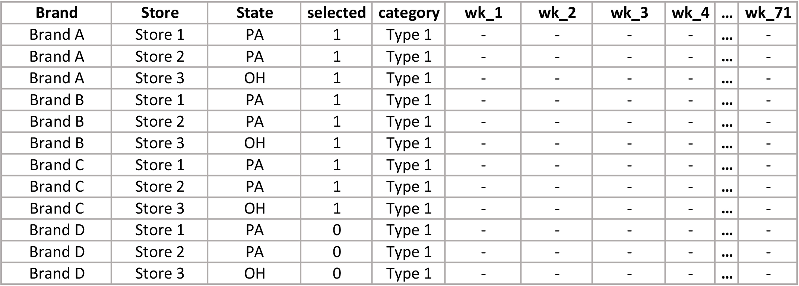
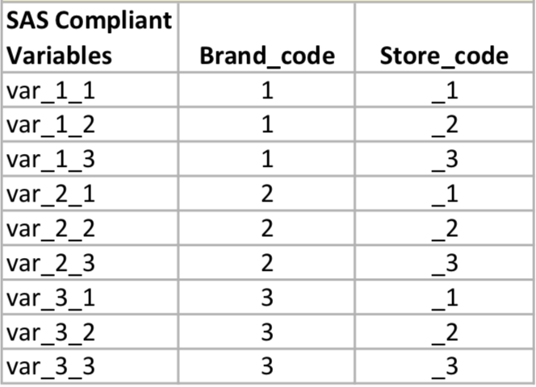
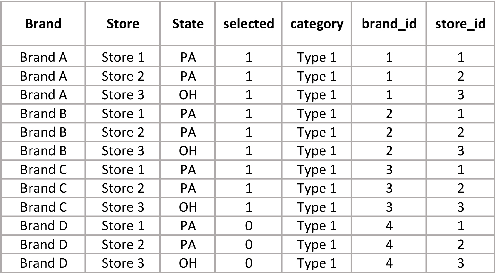
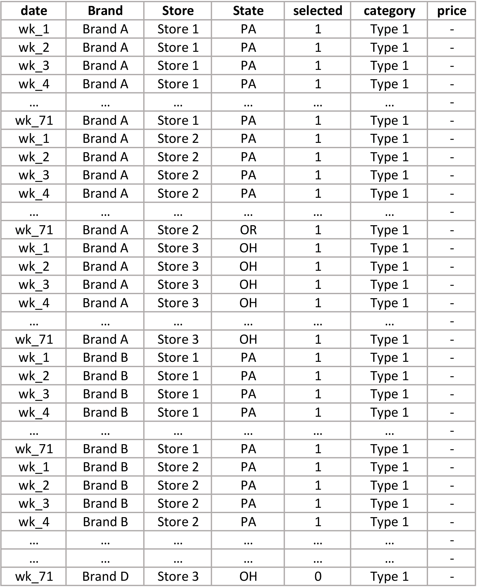

# StackDataMacro
Generalized SAS macro that automatically converts a longitudinal dataset into a vertical dataset.

During my internship, I created two SAS macros to convert a longitudinal dataset into a vertical dataset. The _stackMacro.sas_ script is for a dataset with a single key, and the _stackMacroV2.sas_ script is for a dataset with a two-component key. The macros are completely generalized and require three parameters: the name of the dataset to be converted, the key(s) for that dataset, and the name of the new key for the transformed dataset. The macros also accept a list of variables to copy to the new dataset that would be lost in the transformation.

Ideally, one macro could be written to accept a list of keys so it would transform datasets with any number of keys.

The following section describes the version that handles a two-component key.

## Description of stack macro: stackMacroV2.sas

The following image is the longitudinal dataset with two-component key: Brand and Store. The main metric variable is price, which is represented by hyphens in the week columns. This dataset also contains three variables that will need to be carried over from the original dataset to the vertical dataset: State, selected, and category.

__Step 1: The first step in converting to a vertical format is to create new key variables.__

When the dataset is transposed on the two fields that make up the key, the values contained in those fields will be concatentated to create a new variable. However, these fields may not contain SAS-compliant names. Though there are ways to handle non-SAS-compliant variable names that result from a transpose, I did not find a way to do this within a general program that needed to work with any dataset. Therefore, I created a dataset (below) to hold each new key component. The macro creates the new keys as numbered pairs to identify variable and row combinations as shown. The underscore allows for splitting the variable name later to incorporate the original component key values back into the dataset.

__Step 2: Once the new keys are created, the macro creates a lookup table (below) to hold the original key components and any variables that would be lost in the transpose.__

__Step 3: With SAS-compliant keys in place, the macro transposes the dataset on the new keys.__

The macro then combines the date with each new variable to create multiple datasets to stack on top of each other. The lookup table is combined with the final vertical data and the temporary keys are deleted. The final dataset is displayed below.

